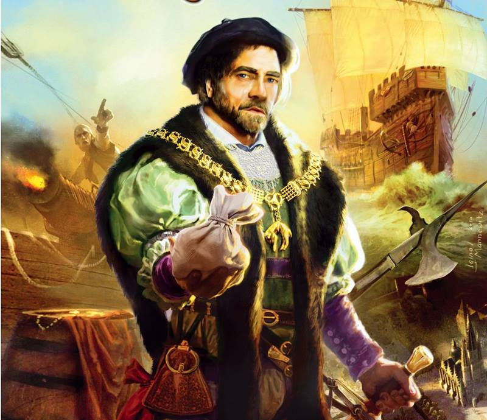

# BizDev, Business Development

This is the pure acquisition of business and enterprise clients, investors and partners.   BizDev is the front end to businesses that want to adopt to Web3, in full capacity.   Focus on user firiendly tools, with a strong UI and UX.  BizDev is also where contracts are bound to service agreements and consulting guidence. Sales and contacts to conventional businesses that wish to adopt some mechanism of their business model to Polkadot.

# A.I. Agent BIANA
- Media
- Legal

BIANA is the A.I. agent for the Eagle DAO, a stage director and contract queen rolled into 1.  BIANA is all about entertainment, ettiqute and (legal) protocol.

---
# Eagle DAO Business Clients
Here is our list of clients for our Eagle DAO consulting division:

# Wheel House (Construction)
Wheelhouse Construction is a construction firm in South Carolina, that is top notch and cutting edge, building houses that dreams are made of, beautiful and practical works of engineering art.

Our proper Polkadot case study for Wheel House is to deploy a chain on Tanssi, with a coin/token component, that will manage payroll and distribute directly to the wallets of employees/contractotrs, also a escrow system that, locks funds and distributes payments as milestones are met and are interlaced with a scheduling system (clickup).

A base multi-sig wallet will serve as the foundational wallet for the Wheel House DAO.

- [Wheelhouse](https://www.wheelhousesc.com/), Construction

---

# Daze of the Wolf (Media)
Daze of the Wolf is a media system for the production of social media. A chain will be deployed, with coin/tokens, to mint NFT objects to interact, and gamify the platform. The main productions are:

- **10-minute technology news**, rendered by A.I. agent (avatar and voice)
- **20-minute hacking and technical edutainment**, A.I. assisted but with a combination of live streams and memes
- **30-minute "radio show" drama**, sci-fi series episodic

It is revenue-driven by:
- Subscriptions
- NFT sales/mining/minting
- Social X monetization, 
- Retail selling (coffee, mushrooms, t-shirts, mugs, gadgets, etc.)

- [Daze of the Wolf](https://www.dazeofthewolf.com), (under construction)

---

# Greenwitch DAO (Revenue A.I. Agent)
Originally, Greenwitch Productions LLC was dissolved and reemerged as Greenwitch DAO. Greenwitch DAO is embedded with A.I. agents that utilize the aggregate of all available datasets (Grok, OpenAI, Deepseeker, Claude, etc.), including its own.

- Primary Function: Revenue generation
- Secondary Function: User onboarding (secure wallet)
- Tertiary Function: DID (or legal wrapping, KYC)

TESS is the interface for the DAO, which helps pair-bond the user interface for the DAO. Only first-generation wallets are required for the credentials for standard Web3 sign-ins to the DAO site. Zero-generation wallets, enshrined by NINA, are once removed to prevent compromise of private keys and mnemonics.

---
---
