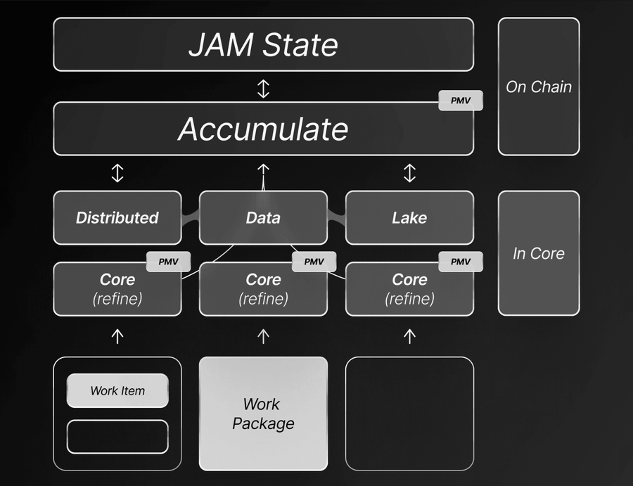
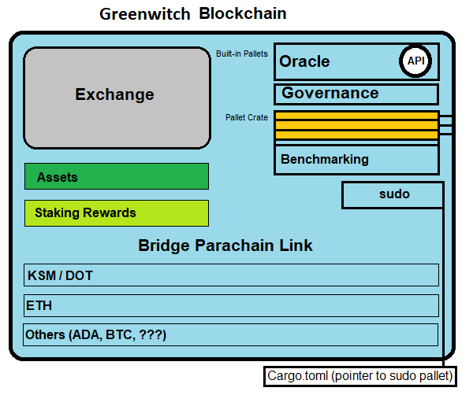

# DevRel Development Relations


Building the foundation for developers on Polkadot. This dives into some very technical aspects, working with businesses and enterprises that already have functioning Web2 systems. The goal of the Eagle DAO is to assist in the acclimation to the Web3 environment.

The idea is to build your OS as your agent, a hardened system (preferably Linux-based), that has everything set up for Polkadot JAM development. We can package this in a Docker container, which would be the first option if the business client is already tech-savvy and has their own cloud. I will outline my bare-metal plan to demonstrate that this can be built more efficiently with your own device, thus reducing cloud costs. Ultimately, we are targeting the replication of Polkadot JAM servers (and services) for the Eagle DAO.

# DAO prototype


# A.I. Agent NINA
- DevOps
- Hacking

The TL;DR layout is:
- Browser: @brave
- Email: @ProtonMail
- Email Alias: @SimpleLogin
- Search Engine: @brave
- Messenger: @signalapp
- Authenticator: @enteio auth
- Notes: @notesnook
- VPN: @mullvadnet
- AI: @brave Leo, @AskVenice, @ollama
 

# Trial By Steel

- ***Legion Lenovo (Hekate)***
- ***ASUSPRO B43S i7/4GIG RAM, 500GB HDD (Lilith)***
- ***Avado***


# Lilith, Born of Metal
- EndeavourOS (Arch Linux), built from scratch and hardened
- Target Hardware: ASUSPRO B43S i7/4GIG RAM, 500GB HDD
- GRUB (bootloader)
- LUKS (HDD encryption)
- VPN (Mullvad)
- Browser (Brave)
- Browser (Firefox)
- Gnome Desktop

# Building Bash Scripts
```bash
#!/bin/bash
# Basic setup script for Lilith

# Update system packages
sudo pacman -Syu

# Install necessary software
sudo pacman -S brave mullvad-vpn firefox gnome

# Setup LUKS encryption (example command, should be done manually for security)
# sudo cryptsetup luksFormat /dev/sda1

# Mount encrypted partition (example)
# sudo cryptsetup luksOpen /dev/sda1 lvm

# Install GRUB
sudo grub-install --target=x86_64-efi --efi-directory=/boot/efi --bootloader-id=GRUB
sudo grub-mkconfig -o /boot/grub/grub.cfg

echo "System setup script completed."
```

# `devop_update.sh`
```bash
#!/bin/bash

# Ensure the script runs as root
if [ "$EUID" -ne 0 ]
  then echo "Please run as root or with sudo"
  exit
fi

echo "Updating system..."
pacman -Syu --noconfirm

echo "Installing Docker..."
pacman -S --noconfirm docker
systemctl enable --now docker

echo "Adding user to docker group..."
usermod -aG docker $SUDO_USER

echo "Installing Docker Compose..."
pacman -S --noconfirm docker-compose

echo "Installing kubectl for Kubernetes..."
pacman -S --noconfirm kubectl

echo "Installing kind for local Kubernetes cluster..."
pacman -S --noconfirm kind

# Prometheus and Grafana
echo "Installing Prometheus..."
pacman -S --noconfirm prometheus

echo "Installing Grafana..."
pacman -S --noconfirm grafana

# Ansible
echo "Installing Ansible..."
pacman -S --noconfirm ansible

# Terraform
echo "Installing Terraform..."
pacman -S --noconfirm terraform

echo "All tools have been installed. You might need to log out and log back in for the docker group change to take effect."

echo "Post-installation steps:"
echo "1. For Docker: Ensure you log out and log back in to apply the group change."
echo "2. For Kubernetes: Use 'kind create cluster' to set up a local cluster."
echo "3. Start Prometheus with 'sudo systemctl start prometheus'."
echo "4. Start Grafana with 'sudo systemctl start grafana-server'."
echo "5. Use 'ansible --version' and 'terraform --version' to verify installations."

echo "Please review the documentation for each tool for further configuration and usage."
```


# additional_tools.sh

```bash
#!/bin/bash

# Ensure the script runs as root
if [ "$EUID" -ne 0 ]
  then echo "Please run as root or with sudo"
  exit
fi

# Function to check if a package is installed
check_installed() {
    if pacman -Q $1 &> /dev/null; then
        echo "$1 is already installed."
        return 0
    else
        echo "$1 is not installed. Installing..."
        return 1
    fi
}

echo "Updating system..."
pacman -Syu --noconfirm

# Development Tools
for pkg in git code neovim; do
    if ! check_installed $pkg; then
        pacman -S --noconfirm $pkg
    fi
done

# System Monitoring and Management
for pkg in htop tmux zsh; do
    if ! check_installed $pkg; then
        pacman -S --noconfirm $pkg
    fi
done

if ! check_installed zsh; then
    sh -c "$(curl -fsSL https://raw.githubusercontent.com/ohmyzsh/ohmyzsh/master/tools/install.sh)"
fi

# Networking Tools
for pkg in wireshark-qt nmap; do
    if ! check_installed $pkg; then
        pacman -S --noconfirm $pkg
    fi
done

# Security Tools
for pkg in fail2ban clamav; do
    if ! check_installed $pkg; then
        pacman -S --noconfirm $pkg
    fi
done

# Database Management
if ! check_installed postgresql; then
    pacman -S --noconfirm postgresql
    systemctl enable --now postgresql
fi

# Container and Orchestration Management
# Check if Docker is running
if ! systemctl is-active --quiet docker; then
    echo "Docker is not running. Please ensure Docker is installed and running before installing Docker-related tools."
else
    # Check if Portainer container is running
    if ! docker ps -q -f name=portainer/portainer-ce &> /dev/null; then
        docker run -d -p 9000:9000 -v /var/run/docker.sock:/var/run/docker.sock -v portainer_data:/data portainer/portainer-ce
    else
        echo "Portainer is already running."
    fi
fi

if ! check_installed helm; then
    pacman -S --noconfirm helm
fi

# Automation and CI/CD
for pkg in jenkins argocd; do
    if ! check_installed $pkg; then
        pacman -S --noconfirm $pkg
        systemctl enable --now $pkg
    fi
done

# Miscellaneous
for pkg in rclone timeshift; do
    if ! check_installed $pkg; then
        pacman -S --noconfirm $pkg
    fi
done

echo "All tools have been checked and installed where necessary. Please note:"
echo "- For Portainer, access it at http://localhost:9000"
echo "- Jenkins and other services might require additional setup."
echo "- Ensure Docker is running for Docker-related tools."
echo "- Review the documentation for each tool for further configuration."
```

# PVM_setup.sh
```bash
#!/bin/bash

# Function to check if a command exists
command_exists() {
    command -v "$1" >/dev/null 2>&1
}

# Update system packages
sudo pacman -Syu --noconfirm

# Install Rust if not installed
if ! command_exists rustc; then
    curl --proto '=https' --tlsv1.2 -sSf https://sh.rustup.rs | sh -s -- -y
    source $HOME/.cargo/env
fi

# Update Rust and add Wasm target if not present
rustup update nightly
if ! rustup target list | grep -q "wasm32-unknown-unknown (installed)"; then
    rustup target add wasm32-unknown-unknown --toolchain nightly
fi

# Install necessary development packages if not installed
packages=("git" "make" "gcc" "clang" "llvm" "protobuf")
for package in "${packages[@]}"; do
    if ! pacman -Q $package >/dev/null 2>&1; then
        sudo pacman -S --noconfirm $package
    fi
done

# Install cargo-contract if not installed
if ! command_exists cargo-contract; then
    cargo install --force --locked cargo-contract
fi

# Clone Substrate Node Template if not present
if [ ! -d "substrate-node-template" ]; then
    git clone https://github.com/substrate-developer-hub/substrate-node-template.git
    cd substrate-node-template
    if ! cargo build --release >/dev/null 2>&1; then
        cargo build --release
    fi
    cd ..
fi

# Install Node.js and npm if not installed
if ! command_exists node; then
    curl -fsSL https://deb.nodesource.com/setup_lts.x | sudo -E bash -
    sudo pacman -S --noconfirm nodejs npm
    npm install -g @polkadot/api-cli
fi

# Ensure Rust environment variables are set
echo 'export PATH="$HOME/.cargo/bin:$PATH"' >> ~/.bashrc
source ~/.bashrc

echo "PVM development tools setup complete or confirmed existing."
```

# EVM_setup.sh
```bash
#!/bin/bash

# Function to check if a command exists
command_exists() {
    command -v "$1" >/dev/null 2>&1
}

# Update system packages
sudo pacman -Syu --noconfirm

# Install Node.js and npm if not installed
if ! command_exists node; then
    curl -fsSL https://deb.nodesource.com/setup_lts.x | sudo -E bash -
    sudo pacman -S --noconfirm nodejs npm
fi

# Install Solidity compiler if not installed
if ! command_exists solc; then
    sudo npm install -g solc
fi

# Install Hardhat if not installed
if ! command_exists npx && ! npx hardhat --version >/dev/null 2>&1; then
    npm install --global hardhat
fi

# Install Foundry if not installed
if ! command_exists forge; then
    curl -L https://foundry.paradigm.xyz | bash
    foundryup
fi

# Install necessary development packages if not installed
packages=("git" "make" "gcc")
for package in "${packages[@]}"; do
    if ! pacman -Q $package >/dev/null 2>&1; then
        sudo pacman -S --noconfirm $package
    fi
done

# Install Remix-IDE CLI if not installed
if ! command_exists remixd; then
    npm install -g @remix-project/remixd
fi

# Install Truffle if not installed
if ! command_exists truffle; then
    npm install -g truffle
fi

# Install web3.js and ethers.js if not installed
if ! npm list -g web3 | grep -q "web3@"; then
    npm install -g web3
fi
if ! npm list -g ethers | grep -q "ethers@"; then
    npm install -g ethers
fi

# Ensure Node.js and npm environment variables are set
echo 'export PATH="$PATH:/usr/local/lib/node_modules"' >> ~/.bashrc

# Source .bashrc to set new environment variables
source ~/.bashrc

echo "EVM development tools setup complete or confirmed existing."
```
