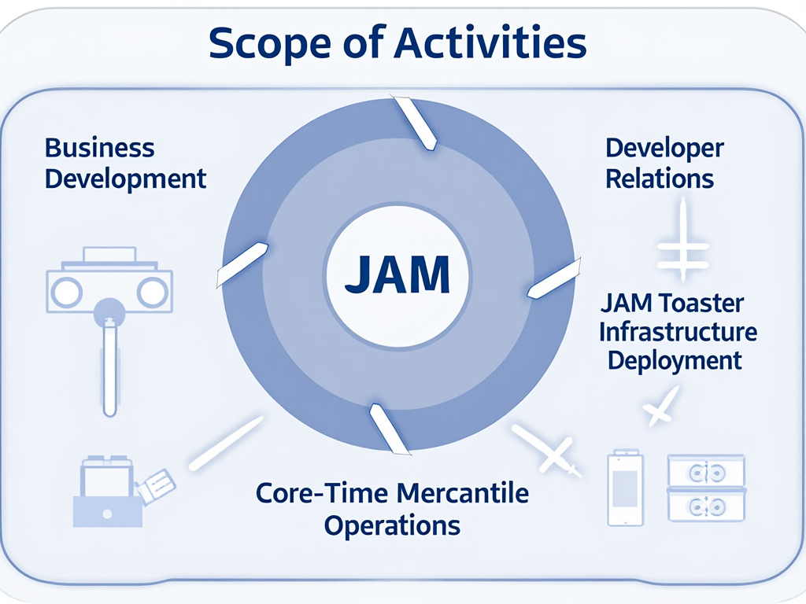

# EagleDAO

Polkadot is poised to revolutionize the U.S. market with its innovative blockchain technology, making this launch not just a milestone but a new era for developers and investors alike. Here's why the U.S. should be excited:

***Interoperability and Scalability:*** 
Imagine a world where blockchains talk to each other as seamlessly as the internet connects websites. Polkadot does just that, serving as a bridge between different blockchains, enabling the transfer of any type of data or asset, not just tokens. This opens up a plethora of opportunities for developers in the U.S. to create applications that were previously unimaginable due to the siloed nature of traditional blockchain systems. With Polkadot, scalability isn't just enhanced; it's transformed into a powerhouse that can handle increased transaction volumes, making it perfect for enterprise-level applications.

***Empowering Developers:***
The U.S. has always been at the forefront of technological innovation, and Polkadot is here to fuel that fire. By providing an open-source sharded multichain protocol, Polkadot gives developers the tools to build or connect custom blockchains with ease. The launch of the Polkadot Software Development Kit (SDK) for Unity is a testament to Polkadot's commitment to developer growth, allowing for the creation of decentralized applications (dApps) and Web3 games that could redefine how we interact with digital spaces. This is a golden era for developers looking to make a mark in blockchain technology.

***Economic Opportunity:***
Polkadot's entry into the U.S. market isn't just about technology; it's about economic empowerment. With a governance model that gives token holders a voice in the network's future, U.S. investors and users can participate directly in shaping one of the most decentralized networks. The project's high staking returns and its ranking among the top blockchains for developer activity signal robust economic prospects. The launch of USDC on Polkadot further solidifies its position as a go-to platform for stablecoin transactions, offering stability and ease of use for American businesses and consumers.

***A New Wave of Adoption:***
With the completion of Polkadot's parachain auctions and the introduction of Polkadot 2.0, scheduled for Q1 2025, the U.S. market is on the cusp of experiencing a surge in blockchain adoption. These upgrades promise enhanced scalability, flexibility, and accessibility, making Polkadot an attractive platform for new projects and existing businesses looking to leverage blockchain for efficiency and innovation. The excitement around these developments is palpable, with posts on X highlighting Polkadot's developer growth and ecosystem expansion.

***Environmental Consciousness:***
In a time where sustainability matters, Polkadot stands out with its green blockchain approach. This resonates well with the U.S. market's growing focus on environmentally friendly technologies, offering a blockchain solution that doesn't compromise on performance for the sake of the planet.

***Launching on Inauguration Day:***
Launching on a day of national significance like the U.S. Presidential Inauguration symbolizes a new beginning, not just for the country but for the blockchain landscape. It's a strategic move to align Polkadot's mission with the spirit of renewal and progress, inviting the U.S. to lead in the next wave of digital transformation.

In essence, Polkadot's arrival in the U.S. market is not just about launching a blockchain; it's about igniting a revolution in how we perceive and utilize blockchain technology. It's an invitation to developers, investors, and visionaries to join a movement that's set to redefine the digital economy, all while being part of a community that values decentralization, innovation, and sustainability.

# Scope of Activities for the EagleDAO

- Eagle DAO's Strategic Vision: Enhancing Business Through Innovation and Technology
- Campaign Trail: Eagle DAO is pioneering a transformative approach to market expansion with our "Eagle JAM" initiative, specifically targeting the U.S. market to elevate Polkadot's presence. This campaign is built on strategic partnerships and resource allocation, driven by our dedicated Business Development (BizDev) and Developer Relations (DevRel) teams, known as "the Treasury" and "the Troops."
- Business Development and Developer Relations: Our BizDev team focuses on establishing robust connections with American businesses, Web3 startups, and tech institutions, aiming to position Polkadot as the premier choice for interoperable blockchain solutions. Concurrently, DevRel engages directly with the developer community, offering technical support and fostering innovation to enhance our ecosystem's capabilities.
- JAM Toasters Management: At the core of our technological infrastructure are the "JAM Toasters," specialized hardware that functions as blockchain validators and collators. These machines are crucial for maintaining the integrity and efficiency of our network, ensuring that our operations in the U.S. not only meet but exceed expectations in terms of performance and reliability.
- Running Validators and Collators: Eagle DAO is at the forefront of managing validation and collation processes, which are pivotal for the smooth operation of blockchain networks. By running these nodes, we contribute to the security, scalability, and decentralization of Polkadot, turning technical operations into opportunities for fostering community growth and technological advancement.
- Core-Time Management: We strategically manage "core-time" for blockchain operations, optimizing resource allocation to ensure profitability and efficiency. This involves sophisticated scheduling and management practices that allow maximum utility and performance from our blockchain infrastructure.
- Staking the DAO Treasury: Our approach to treasury management includes staking assets to generate yields, thereby increasing the financial sustainability of our operations. This strategy not only supports our BizDev and DevRel initiatives but also ensures that our community benefits from the returns, strengthening the overall economic model of the DAO.

Eagle DAO is committed to building businesses better, not just through innovative technology but through a vision that integrates business acumen with technological prowess, ensuring that every step we take is towards a more interconnected, efficient, and prosperous blockchain ecosystem.

