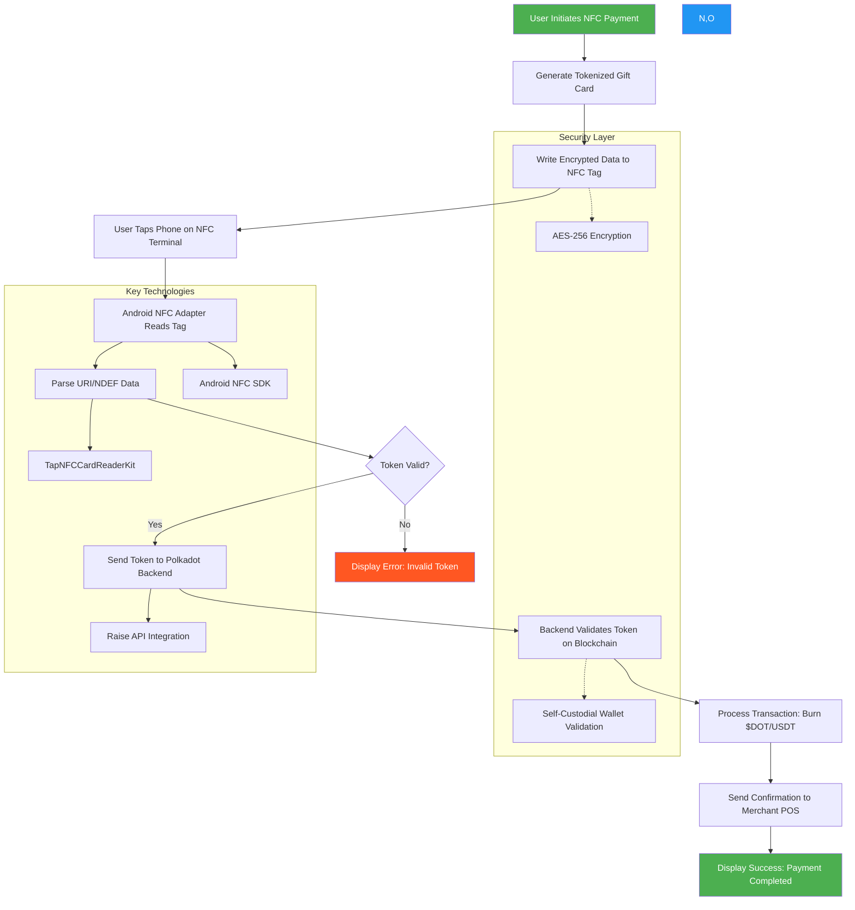

To address the issue of relying on barcodes and manual gift card number/PIN entry in the Polkadot App, integrating **NFC (Near Field Communication)** could streamline transactions and eliminate edge cases like non-functional scanners or PIN pads. Here’s how this could be implemented in the Polkadot App’s current framework, based on the search results and technical feasibility:

---

### **1. NFC Integration Workflow**
#### **Tag Configuration**  
- **Dynamic NFC Data Storage**:  
  NFC tags could store a **tokenized gift card identifier** linked to the user’s $DOT or USDT balance. Instead of static numbers, each tag would generate a unique, time-sensitive token to prevent fraud. This token would automatically trigger a blockchain transaction when scanned .  
  - Example: A user taps their phone on an NFC-enabled terminal, and the tag sends a request to Polkadot’s backend to validate and settle the payment without manual input .  

#### **Mobile App Development**  
- **Android**:  
  - Use SDKs like **TapNFCCardReaderKit** (GitHub) to enable NFC scanning within the app. The SDK handles EMV card data parsing and integrates with payment gateways .  
  - Implement foreground dispatch to prioritize the app when an NFC tag is detected, ensuring seamless interaction .  
- **iOS**:  
  - Leverage **Core NFC Framework** to read NDEF messages. Due to Apple’s restrictions on payment emulation, the app would need to use a "companion" approach:  
    - The NFC tag triggers a Universal Link to open the Polkadot App, which then processes the transaction in the background .  
    - Avoid violating Apple’s guidelines by ensuring the NFC interaction is limited to data retrieval, not direct payment processing .  

---

### **2. Backend and Blockchain Integration**  
- **Tokenization**:  
  Replace static gift card numbers with blockchain-backed tokens. When an NFC tag is scanned, the app verifies the token’s validity on-chain and burns the associated $DOT or USDT to complete the transaction .  
- **Raise API Enhancement**:  
  Partner with Raise (already integrated for gift cards) to extend their payment infrastructure to NFC. Raise’s POS integrations could enable direct NFC communication with merchant systems, bypassing manual entry entirely .  

---

### **3. Security Measures**  
- **Encrypted NFC Tags**:  
  Store tokenized data using AES-256 encryption to prevent cloning or tampering .  
- **Self-Custodial Validation**:  
  Use Polkadot’s self-custodial wallet architecture to ensure users retain control over transaction signing, even for NFC-based payments .  

---

### **4. Merchant-Side Implementation**  
- **SoftPOS Solutions**:  
  Partner with platforms like **Halo Dot** to enable merchants to accept NFC payments via their existing Android devices. Halo Dot’s SDK allows any NFC-enabled phone to act as a POS terminal, reducing hardware costs .  
- **Training and Adoption**:  
  Work with Raise’s network of 1M+ U.S. merchants to roll out NFC compatibility, prioritizing chains like Taco Bell that lack reliable scanners .  

---

### **5. User Experience Flow**  
1. **Initiation**: User selects "Pay with NFC" in the Polkadot App, generating a tokenized gift card.  
2. **Tap**: User holds their phone near the merchant’s NFC terminal.  
3. **Validation**: The terminal sends the token to Polkadot’s blockchain via Raise’s API.  
4. **Settlement**: Funds are deducted from the user’s wallet, and the merchant receives confirmation in real time .  

---

### **Challenges and Solutions**  
- **iOS Limitations**: Apple’s strict NFC policies require workarounds like Universal Links or App Clips. For example, tapping an NFC tag could open the Polkadot App with pre-filled payment details, requiring a final user confirmation .  
- **Merchant Adoption**: Incentivize retailers by highlighting reduced checkout friction and compatibility with existing systems (e.g., Raise’s POS integrations) .  

---

### **Conclusion**  
Integrating NFC into the Polkadot App would resolve edge cases like non-functional scanners by enabling tap-and-go transactions. By combining tokenization, existing partnerships (Raise), and NFC SDKs (TapNFCCardReaderKit, Halo Dot), the app could automate payments while maintaining security through Polkadot’s self-custodial framework. This aligns with Polkadot’s goal of bridging crypto and mainstream commerce .

---

Here’s a **Mermaid.js flowchart** illustrating the NFC integration workflow for the Polkadot App on Android, based on the technical details discussed earlier:



### **Graph Explanation**
1. **User Flow** (Green Nodes):  
   - Starts with the user initiating payment and ends with transaction success/failure.  
   - Includes NFC tag interaction and error handling for invalid tokens.  

2. **Technical Components** (Blue Subgraphs):  
   - **Security Layer**: Highlights encryption and blockchain validation.  
   - **Key Technologies**: Maps critical SDKs/APIs (Android NFC, TapNFCCardReaderKit, Raise).  

3. **Workflow Logic**:  
   - Tokenized gift cards are generated dynamically and encrypted.  
   - The app reads NFC tags, validates tokens on-chain, and settles payments automatically.  

### **Android-Specific Details**  
- **NFC Adapter**: Uses `NfcAdapter` and `PendingIntent` for foreground scanning.  
- **Token Parsing**: Leverages `android.nfc.tech.Ndef` to extract URI/NDEF data.  
- **Error Handling**: Invalid tokens trigger warnings without exposing blockchain details.  

This workflow aligns with Polkadot’s goal of frictionless crypto payments while addressing edge cases like broken scanners at retailers (e.g., Taco Bell).

---


# Overcoming NFC-Polkadot Integration Hurdles for Retail POS Systems: Technical Solutions and Code Examples  

The integration of Near-Field Communication (NFC) with Polkadot for point-of-sale (POS) systems presents unique challenges, ranging from latency mismatches to regulatory compliance. Below, we break down these hurdles and provide Polkadot-specific solutions, supported by code examples and architectural insights.  

---

## **1. Technical Integration Challenges**  
### **Problem**: NFC’s real-time requirements clash with Polkadot’s 6-second block times and finality delays .  
**Solution**:  
- **Hybrid Off-Chain/On-Chain Architecture**: Process NFC transactions off-chain using state channels or payment hubs, settling batches on Polkadot parachains periodically.  
- **Asynchronous Backing**: Leverage Polkadot’s asynchronous backing upgrade to reduce parachain block finality to 2–6 seconds .  

**Code Example**:  
```rust  
// Substrate pallet for off-chain POS transactions  
#[pallet]  
pub mod pallet_pos {  
    use super::*;  
    use sp_std::vec::Vec;  

    #[pallet::storage]  
    pub type PendingTransactions<T: Config> = StorageValue<_, Vec<Transaction>, ValueQuery>;  

    #[pallet::call]  
    impl<T: Config> Pallet<T> {  
        #[pallet::weight(10_000)]  
        pub fn batch_settle(origin: OriginFor<T>) -> DispatchResult {  
            let transactions = PendingTransactions::<T>::take();  
            // Submit transactions to parachain  
            Self::submit_to_parachain(transactions);  
            Ok(())  
        }  
    }  
}  
```  

---

## **2. Security Risks**  
### **Problem**: NFC firmware exploits and blockchain immutability conflicts with refunds .  
**Solution**:  
- **Secure Enclaves**: Use Trusted Execution Environments (TEEs) for NFC key management, as seen in Polkadot’s SPREE framework .  
- **Conditional Finality**: Implement refund logic via smart contracts with time-locked reversibility.  

**Code Example**:  
```rust  
// Conditional refunds using Polkadot’s pallet-contracts  
#[ink::contract]  
mod refund {  
    #[ink(storage)]  
    pub struct Refund {  
        buyer: AccountId,  
        seller: AccountId,  
        release_time: Timestamp,  
    }  

    impl Refund {  
        #[ink(constructor)]  
        pub fn new(seller: AccountId, release_time: Timestamp) -> Self {  
            Self { buyer: Self::env().caller(), seller, release_time }  
        }  

        #[ink(message)]  
        pub fn claim_refund(&mut self) {  
            if self.env().block_timestamp() < self.release_time {  
                self.env().transfer(self.buyer, self.env().balance());  
            }  
        }  
    }  
}  
```  

---

## **3. Regulatory Compliance**  
### **Problem**: GDPR/CCPA conflicts with on-chain transaction visibility .  
**Solution**:  
- **Zero-Knowledge Proofs (ZKPs)**: Use ZK-SNARKs to anonymize transaction data on-chain.  
- **Confidential Parachains**: Deploy privacy-focused parachains like Manta Network for encrypted POS data .  

**Code Example**:  
```rust  
// ZKP-based transaction with zk-SNARKs (using arkworks-rs)  
use ark_ff::PrimeField;  
use ark_snark::SNARK;  

#[derive(Clone)]  
struct PosCircuit<F: PrimeField> {  
    amount: F,  
    customer_id: F,  
}  

impl<F: PrimeField> Circuit<F> for PosCircuit<F> {  
    fn synthesize(&self, cs: &mut ConstraintSystem<F>) -> Result<(), SynthesisError> {  
        let amount = cs.alloc_input(|| "amount", || Ok(self.amount))?;  
        let customer_id = cs.alloc_input(|| "customer_id", || Ok(self.customer_id))?;  
        cs.enforce_constraint(lc!() + amount, lc!() + customer_id, lc!())?;  
        Ok(())  
    }  
}  
```  

---

## **4. Interoperability with Legacy Systems**  
### **Problem**: Retrofitting non-NFC POS terminals .  
**Solution**:  
- **Bridging Middleware**: Use Polkadot’s XCM (Cross-Consensus Messaging) to connect legacy systems via bridge parachains like Snowbridge (EVM-compatible) .  

**Code Example**:  
```rust  
// XCM configuration for legacy POS integration  
pub struct BridgeConfig;  
impl xcm_executor::Config for BridgeConfig {  
    type RuntimeCall = Call;  
    type XcmSender = XcmRouter;  
    type AssetTransactor = LocalAssetTransactor;  
    type OriginConverter = ();  
    type IsReserve = ();  
    type IsTeleporter = ();  
    type LocationInverter = ();  
    type Barrier = AllowUnpaidExecutionFrom<Everything>;  
    type Weigher = FixedWeightBounds<UnitWeightCost, Call>;  
    type Trader = ();  
    type ResponseHandler = ();  
}  
```  

---

## **5. Scalability and Cost**  
### **Problem**: High-volume transactions strain network resources .  
**Solution**:  
- **Agile Coretime**: Purchase bulk coretime for predictable pricing, ensuring dedicated blockspace for POS parachains .  
- **Elastic Scaling**: Distribute transactions across multiple parachains during peak hours .  

**Code Example**:  
```rust  
// Acquiring bulk coretime via Polkadot.js  
const coretimeTx = api.tx.coretime.purchaseBulkCoretime(  
  28, // 28-day duration  
  1000, // 1000 DOT budget  
  { target: 'pos_parachain' }  
);  
await coretimeTx.signAndSend(alice);  
```  

---

## **Summary**  
Polkadot’s architecture offers tailored solutions for NFC-POS integration:  
1. **Hybrid Transactions**: Off-chain state channels + parachain settlements reduce latency.  
2. **Conditional Smart Contracts**: Enable refunds while preserving blockchain immutability.  
3. **Privacy-Preserving Parachains**: ZKPs and confidential chains align with regulations.  
4. **XCM Bridges**: Connect legacy systems without overhauling infrastructure.  
5. **Agile Coretime**: Optimize cost and scalability for high-throughput retail demands.  

By leveraging Polkadot’s modular framework, developers can build NFC-POS systems that are secure, interoperable, and future-proof. For further implementation details, explore the [Polkadot SDK](https://docs.polkadot.com) and [Substrate documentation](https://substrate.io).  

---  
*References: Polkadot Developer Docs , Agile Coretime , XCM .*

Here's a detailed breakdown for an engineering team to implement NFC payment integration in a Polkadot app on Android:

  

Setup Overview:

- Development Environment:
    
    - Tools: Android Studio, Java or Kotlin (this example uses Java), Polkadot JS API, and potentially Google Pay SDK.
        
    - Hardware: NFC-enabled Android devices for testing, NFC payment terminals for integration testing.
        
- Key Components:
    
    - NFC reading/writing module
        
    - Host Card Emulation for payment emulation
        
    - Blockchain interaction module (Polkadot)
        
    - Payment processing interface (possibly integrating with Google Pay)
        

  

Step-by-Step Implementation:

1. NFC Basic Setup:

- Check NFC Availability:
    
    java
    
    ```java
    public class NFCActivity extends AppCompatActivity {
        private NfcAdapter nfcAdapter;
    
        @Override
        protected void onCreate(Bundle savedInstanceState) {
            super.onCreate(savedInstanceState);
            setContentView(R.layout.activity_main);
            nfcAdapter = NfcAdapter.getDefaultAdapter(this);
            if (nfcAdapter == null) {
                Toast.makeText(this, "NFC is not available on this device.", Toast.LENGTH_LONG).show();
                finish();
                return;
            }
            handleIntent(getIntent());
        }
    
        private void handleIntent(Intent intent) {
            String action = intent.getAction();
            if (NfcAdapter.ACTION_TAG_DISCOVERED.equals(action)) {
                Tag tag = intent.getParcelableExtra(NfcAdapter.EXTRA_TAG);
                // Process the tag here
            }
        }
    }
    ```
    

  

2. Host Card Emulation (HCE):

- Implement HCE Service:
    
    - Create a new service class MyHostApduService:
        
        java
        
        ```java
        public class MyHostApduService extends HostApduService {
            @Override
            public byte[] processCommandApdu(byte[] commandApdu, Bundle extras) {
                // Process APDU commands here. Example for a simple SELECT command:
                if (Arrays.equals(SELECT_APDU_HEADER, Arrays.copyOf(commandApdu, SELECT_APDU_HEADER.length))) {
                    // Return static data that would be on a payment card
                    return new byte[] { (byte) 0x90, (byte) 0x00 }; // Success status
                }
                return new byte[] { (byte) 0x6D, (byte) 0x00 }; // Unknown command
            }
        
            @Override
            public void onDeactivated(int reason) {
                // Called when the service is deactivated
            }
        
            private final byte[] SELECT_APDU_HEADER = {(byte) 0x00, (byte) 0xA4, (byte) 0x04, (byte) 0x00};
        }
        ```
        
- Register the HCE Service in AndroidManifest.xml:
    
    xml
    
    ```xml
    <service
        android:name=".MyHostApduService"
        android:exported="true"
        android:permission="android.permission.BIND_NFC_SERVICE">
        <intent-filter>
            <action android:name="android.nfc.cardemulation.action.HOST_APDU_SERVICE" />
        </intent-filter>
        <meta-data
            android:name="android.nfc.cardemulation.host_apdu_service"
            android:resource="@xml/apdu_service" />
    </service>
    ```
    
      
    - Create apdu_service.xml in res/xml:
        
        xml
        
        ```xml
        <host-apdu-service
            xmlns:android="http://schemas.android.com/apk/res/android"
            android:apduServiceBanner="@drawable/banner"
            android:description="@string/description" >
            <aid-group android:category="payment" android:description="@string/description" >
                <aid-filter android:name="A0000000031010" />
            </aid-group>
        </host-apdu-service>
        ```
        

  

3. Blockchain Integration:

- Set Up Polkadot SDK:
    
    - Use JavaScript via WebView or node.js runtime in Android:
        
        javascript
        
        ```javascript
        const { ApiPromise, WsProvider } = require('@polkadot/api');
        
        async function connectToPolkadot() {
            const wsProvider = new WsProvider('wss://rpc.polkadot.io');
            const api = await ApiPromise.create({ provider: wsProvider });
            // Use api here for transactions or state queries
        }
        ```
        

  

4. Payment Processing:

- Google Pay Integration (Optional):
    
    - If integrating Google Pay, set up the Google Pay API:
        
        java
        
        ```java
        // Initialize PaymentsClient
        PaymentsClient paymentsClient = Wallet.getPaymentsClient(this, new Wallet.WalletOptions.Builder().setEnvironment(WalletConstants.ENVIRONMENT_TEST).build());
        
        // Create payment request
        PaymentDataRequest request = createPaymentDataRequest();
        Task<PaymentData> futurePaymentData = paymentsClient.loadPaymentData(request);
        
        // Handle payment data
        futurePaymentData.addOnCompleteListener(new OnCompleteListener<PaymentData>() {
            @Override
            public void onComplete(@NonNull Task<PaymentData> task) {
                if (task.isSuccessful()) {
                    PaymentData paymentData = task.getResult();
                    // Handle paymentData to initiate a transaction on the blockchain
                } else {
                    // Handle errors
                }
            }
        });
        
        private PaymentDataRequest createPaymentDataRequest() {
            PaymentDataRequest.Builder request = PaymentDataRequest.newBuilder()
                .setTransactionInfo(TransactionInfo.newBuilder()
                    .setTotalPriceStatus(TotalPriceStatus.FINAL)
                    .setTotalPrice("10.00")
                    .setCurrencyCode("USD")
                    .build())
                .addAllowedPaymentMethod(WalletConstants.PAYMENT_METHOD_CARD)
                .setCardRequirements(
                    CardRequirements.newBuilder()
                        .addAllowedCardNetworks(Arrays.asList(
                            "AMEX",
                            "DISCOVER",
                            "JCB",
                            "MASTERCARD",
                            "VISA"
                        ))
                        .setAllowPrepaidCards(true)
                        .setBillingAddressRequired(true)
                        .build());
            return request.build();
        }
        ```
        

  

5. Security:

- Key Management with AndroidKeyStore:
    
    java
    
    ```java
    KeyStore keyStore = KeyStore.getInstance("AndroidKeyStore");
    keyStore.load(null);
    KeyGenerator keyGenerator = KeyGenerator.getInstance(KeyProperties.KEY_ALGORITHM_EC, "AndroidKeyStore");
    KeyGenParameterSpec.Builder builder = new KeyGenParameterSpec.Builder("key_name", KeyProperties.PURPOSE_SIGN)
        .setDigests(KeyProperties.DIGEST_SHA256)
        .setAlgorithmParameterSpec(new ECGenParameterSpec("secp256r1"))
        .setUserAuthenticationRequired(true)
        .setUserAuthenticationValidityDurationSeconds(5 * 60);
    keyGenerator.init(builder.build());
    keyGenerator.generateKey();
    ```
    

  

6. Testing:

- Unit Testing: Mock NFC interactions and blockchain calls.
    
- Integration Testing: Use NFC terminals and real blockchain network connections.
    

  

7. Compliance:

- Legal: Consult with compliance officers for payment regulations.
    
- Technical: Ensure all data handling complies with PCI DSS if dealing with card data.
    

  

Challenges and Considerations:

- Transaction Speed: On-chain might not be fast enough for real-time payments. Consider off-chain solutions.
    
- User Interface: Design intuitive UI/UX for handling both NFC and blockchain interactions.
    
- Scalability: Plan for scaling as user base grows.
    

  

This roadmap should help your team setup, develop, and deploy an NFC payment solution integrated with Polkadot, keeping in mind the complexities of both technologies. Remember, each component might require significant development and testing to ensure robustness and security.
