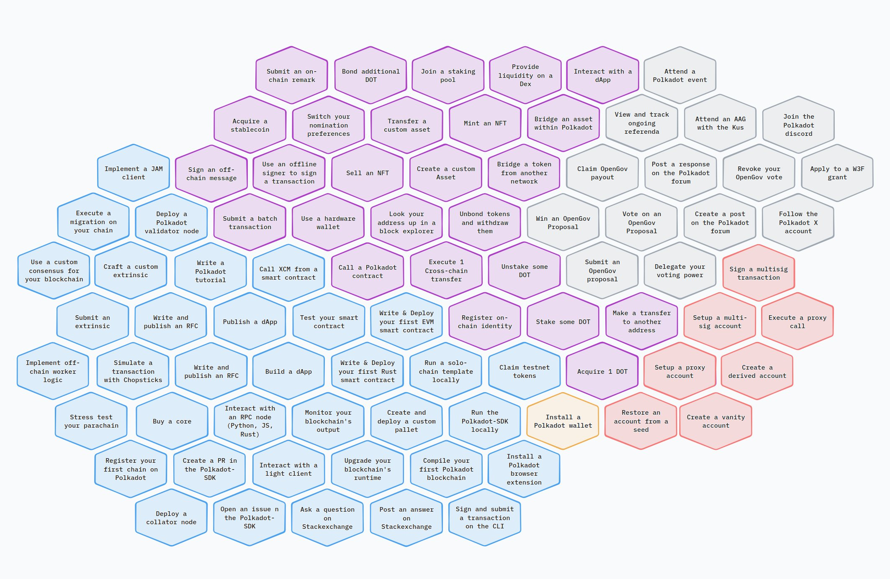

# Polkadot Polarity

In order to become proficient with crypto and the blockchain ecosystems, on must start with a foundation

***Gold/Yellow (Wallet - Foundation):***
        - Acquire 1 DOT
        - Bond additional DOT
        - Unbond tokens and withdraw them
        - Stake some DOT
        - Unstake some DOT

***Blue (Code and Engineering):***
        - Implement a JAM client
        - Execute a migration on your chain
        - Use a custom consensus for your blockchain
        - Implement off-chain worker logic
        - Simulate a transaction with Chopsticks
        - Stress test your parachain
        - Register your first chain on Polkadot
        - Deploy a collator node
        - Write a Polkadot tutorial
        - Write and publish an RFC
        - Build a dApp
        - Write & Deploy your first EVM smart contract
        - Write & Deploy your first Rust smart contract
        - Run a solo-chain template locally
        - Create a PR in the Polkadot-SDK
        - Compile your Polkadot blockchain locally
        - Upgrade your blockchain's runtime
        - Create and deploy a custom pallet
        - Interact with an RPC node (Python, JS, Rust)
        - Monitor your blockchain's output
        - Interact with a light client
        - Test your smart contract
        - Open an issue on the Polkadot-SDK
        - Ask a question on StackExchange
        - Post an answer on StackExchange

***Pink (Administration of Assets):***
        - Transfer custom asset
        - Mint an NFT
        - Sell an NFT
        - Create a custom Asset
        - Bridge an asset within Polkadot
        - Bridge a token from another network
        - Make a transfer to another address
        - Claim testnet tokens

***Grey (Governance):***
        - Claim OpenGov payout
        - Win an OpenGov Proposal
        - Vote on an OpenGov proposal
        - Submit an OpenGov proposal
        - Attend an AAG with the Kus

***Orange (Wallet - Advanced Options):***
        - Setup a multisig account
        - Setup a proxy account
        - Restore an account from a seed
        - Create a derived account
        - Create a vanity account
        - Execute a proxy call
        - Sign a multisig transaction

***Purple (General Interaction and Community):***
        - Submit an on-chain remark
        - Join a staking pool
        - Provide liquidity on a DEX
        - Interact with a dApp
        - View and track ongoing referenda
        - Post a response on the Polkadot forum
        - Create a post on the Polkadot forum
        - Attend a Polkadot event
        - Join the Polkadot discord
        - Follow the Polkadot X account


This categorization helps in understanding the scope of activities within the Polkadot ecosystem, from basic wallet operations to advanced governance and engineering tasks.

```html
<!DOCTYPE html>
<html lang="en">
<head>
    <meta charset="UTF-8">
    <meta name="viewport" content="width=device-width, initial-scale=1.0">
    <title>Polkadot Task Categories</title>
    <style>
        body {
            font-family: Arial, sans-serif;
            display: flex;
            justify-content: center;
            align-items: center;
            height: 100vh;
            margin: 0;
            background-color: #f0f0f0;
        }
        .container {
            text-align: center;
        }
        .image-container {
            margin-bottom: 20px;
        }
        .category {
            margin: 10px 0;
            font-weight: bold;
        }
        .category span {
            display: inline-block;
            padding: 5px 10px;
            margin-right: 5px;
            border-radius: 5px;
        }
        .gold { background-color: gold; }
        .blue { background-color: #87CEEB; }
        .pink { background-color: pink; }
        .grey { background-color: grey; }
        .orange { background-color: orange; }
        .purple { background-color: #DDA0DD; }
    </style>
</head>
<body>
    <div class="container">
        <div class="image-container">
            
        </div>
        <div class="categories">
            <div class="category">Wallet (Foundation) <span class="gold">Gold/Yellow</span></div>
            <div class="category">Code and Engineering <span class="blue">Blue</span></div>
            <div class="category">Administration of Assets <span class="pink">Pink</span></div>
            <div class="category">Governance <span class="grey">Grey</span></div>
            <div class="category">Wallet Advanced Options <span class="orange">Orange</span></div>
            <div class="category">General Interaction and Community <span class="purple">Purple</span></div>
        </div>
    </div>
</body>
</html>
```
