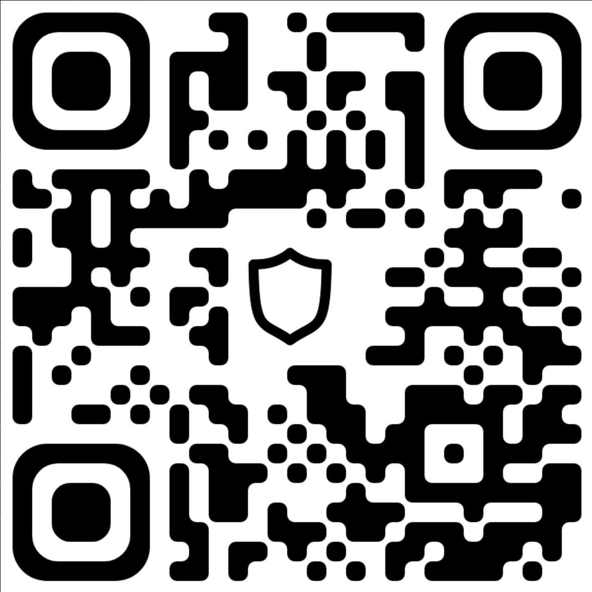

# Frequently Asked Questions
### Projects, Particulars, Payment
FAQ centers around the 3 "P"s, Projects (what it is), Particulars (what is required for it), Payment (payment channels to do it).  Before any roles or contracts will be considered 3 "P"s must be agreed to, the type of projects that are being worked on, the paticulars of what is required to work on them and the payment (renumeeration) for working on the projects with the correct particulars.

## Engagement Guidelines:

1. ***Remote Work Policy:*** We require the availability of remote work options for all positions. In situations where a role necessitates on-site presence without any remote work flexibility, the contractual arrangement must encompass extensive provisions for relocation assistance and housing subsidies.

2. ***Preferred Employment Type:*** Our preference is to establish an engagement structure through a ***Decentralized Autonomous Organization (DAO)*** within GreenWitchDAO. We are also open to exploring 1099 contract roles, depending on the specific project's requirements, particularly those related to Blockchain and A.I. However, it's important to note that we generally do not favor or entertain W2 employment positions, as they do not align with our established business model.

3. ***Price Points:*** Determining an appropriate compensation level without precise knowledge of the project or its specific details is challenging. Compensation negotiations will be initiated once a budget has been established, comprehensive project details have been disclosed and thoroughly understood, and a formal offer has been extended. Until these crucial steps are completed, it is reasonable to consider local market rates as an initial reference point for assessing compensation.

4. ***Compensation:*** All remuneration for services must be in cryptocurrency, perferably in BTC.

## Payment Gateway
***BTC***, Bitcoin (***bc1qfzk3e34w72vny4va5ymvswezkfnu0nvxpqyul3***).  Always Prefered.

### Other wallets are available:
- Monero (XMR)
- Polkadot (DOT)
- Cosmos (ATOM)
### Suitable stablecoin 
- USDC
- USDT
