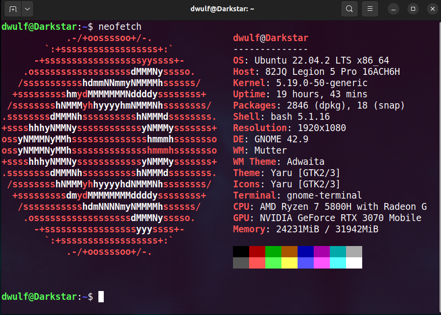

# Game Theory
I play games, it sharpens the creative mind and helps me think on how to solve real-world problems.
RPGs are my favorite, but I also enjoy the first person adventure shooter also.

# My Tech

## Space
- Star Citizen
- - The first and most expesive first date dissapointment, perpetually in Beta and always under construction, (but isn't all software that way?).  I think I bled about $600 on my ships, but haven't been too involved as moding is not all there.  Jokes aside...It's getting better
- Eilte Dangerous
- - They got a whole virtual Galaxy, and it is a whole lot of nothing, but mostly empty space.  Most of the action is in the bubble and you must grind to get the good stuff.  Took a trip to the A* primodial blackhole in the center of the galaxy, but if you have seen one blackhole you seen them all.  Blackhole effects just overheat and destroy the ship.
- Starfield
- - Just out, to be released in Sept 2023, can't wait, and yes I did pre order, the premium edition, mostly for the DLC Shatered Space, I am looking forward to this one, single player, very modable, and a Bethesda game to boot, the same Todd that brought us SKyrim, and Fallout.
  - [Starfield Navigator](https://www.s9w.io/starfield_navigator/)
    

# dwulf
Human, Thief/Smuggler
Male
### Cyber Runner
- Combat/Pistol Certification
- Tech/Security
- Social/Persuasion

Triats
- Terra Firma
- Freestar Collective

Story:
dwulf is a Time Traveler from acient Earth, he came to the future from a top secret FTL star craft that was being constructed being trasported to be tested, but he escaped with the ship.  Due to a misconfiguration of the FTL computers, dwulf, time-dialated through space-time to the current future present.

From there he has been trying to adapt to the new space faring world.

- 
## RPG Cyberpunk
- CyberPunk 2077
- - This is the only Cyberpunk game I am very much into, but I played this so many times already, just waiting for the DLC, to rescue the president.

## RPG Fantasy
- Skyrim
- - What can I say, this is the D&D simulator the way the Gods meant it to be, with Mods you can turn this into a perfect setting for mini-movies and media.

