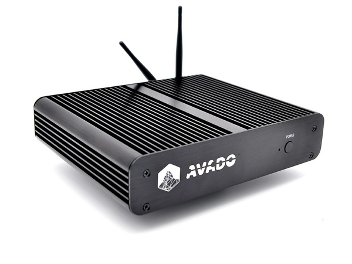
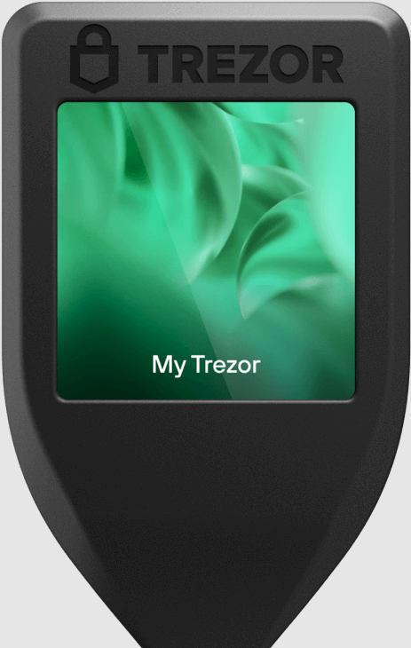
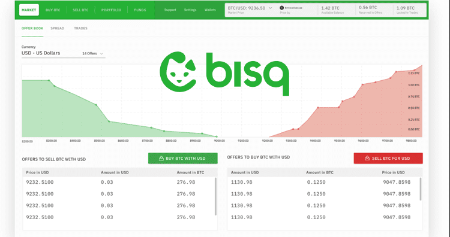

# Blockchain and Crypto Currencies

# 5 Pillars of Crypto
- ***Open (Permissionless)***
- ***Public (Available to Everybody)***
- ***Borderless (Not sovergien centralized)***
- ***Neutral (Impartial)***
- ***Censorship Resistant*** 

The essence of the cryptocurrency ecosystem and the principles that underline blockchain technology are embodied in these five pillars: Openness, Public Availability, Borderless Functionality, Neutrality, and Censorship Resistance. Collectively, they ensure the inclusivity, reliability, and decentralization necessary for a sustainable and resilient cryptocurrency ecosystem.

1. - ***Open (Permissionless):*** The 'Open' or 'Permissionless' nature of cryptocurrencies is an essential feature that ensures inclusivity and fosters innovation. This pillar allows anyone, anywhere, to create, innovate, and participate in the network without requiring authorization. It fundamentally shifts the traditional paradigm of selective access and, in doing so, opens up endless possibilities for financial and technological inclusion and evolution.

2. - ***Public (Available to Everybody):*** Public availability ensures that everyone, regardless of their geographic location or socio-economic status, has the opportunity to engage with the blockchain. This principle democratizes access to financial services, reducing the inequalities perpetuated by traditional banking systems. Blockchain transactions are transparent and can be verified by anyone using the network, which ensures trust and integrity within the system.

3. - ***Borderless (Not Sovereign Centralized):*** The borderless nature of cryptocurrencies negates the constraints imposed by national borders and central authorities. This allows for truly global participation and interoperability, freeing individuals and businesses from the limitations of traditional financial systems. Borderless operations promote economic growth and financial inclusion, particularly for those in countries with unstable economies or limited access to financial services.

4. - ***Neutral (Impartial):*** The principle of neutrality ensures that the system operates without bias, and that each transaction is treated equally, irrespective of the parties involved or the size of the transaction. This impartiality eliminates the potential for manipulation and preserves the integrity of the cryptocurrency ecosystem.

5. - ***Censorship Resistant:*** The censorship resistance of blockchain technology protects users against third-party interventions, ensuring that all transactions are immutable and cannot be altered or deleted. This attribute safeguards the rights and freedoms of users and promotes the trustworthiness of the network.

In conclusion, these five pillars are not just the guiding principles of the cryptocurrency ecosystem; they are its very foundation. They foster a space that is inclusive, transparent, and decentralized, providing a more equitable financial framework for the global community. Any deviation from these principles would disrupt the very essence of the cryptocurrency ecosystem, thereby undermining the advantages it provides over traditional financial systems. Therefore, adherence to these pillars is imperative for the interoperability and the future success of the cryptocurrency ecosystem.

## Blockchain/Cold Wallet (Trezor)
You will require a crypto wallet, it must be air gaped, it must be on a hardware wallet, code must be open sourced, and crypto steel recovery etchings are highly recomended for your private key words.  Once this hardware wallet has been obtained and christened with a off-line mnemonic, you have your official Vault also know as your Stash.

## Blockchain/Warm Wallet (browser modules, Metamask, etc.)
Once you have a cold wallet, you can dispurse your cypto to "online" wallets, that you own and run through a hardened OS and Browser, Metamask (For Ethereum networks) is a good example, Keplr (for Cosmos networks), etc.

### Mobile/Warm Wallet (Nova, Trust, CashApp, etc.)
Mobile wallets are another type of warm wallet, still "online" and run through a hardened Andriod device and its own application, but theoretically can be run through the browser of the Andriod device.

## Hot Wallets (all centralized exchanges by default, decentralized exchanges by implementation)
Hot Wallets are the worst, on centralized exchanges the centralized exchange nessesarily requires knowledge of your secret key to sign
 for trading transactions; you are trusting that the exchange (and its employees), are on the level, you are trusting that they have encrypted your KYC records and they are under top grade protection, you are trusting the actual exchanges security to protect the integrity of your trades and exchanges.

With Decentralized exchanges, you are trusting the code of the contract.  Rust bugs are rare and non-existant for memory errors and glitches.  You still own your keys and only the smart contract code has access to it to implement its functions.

## Blockchain/Crypto (Avado Metal)
The Blockchain is the capital resource for all operations and projects.  While it is true grants and sponcerships are available
for Blockchain projects, the pourpose of having a Avado unit is to house one's own "bank".   When connected with an appropriate 
fiat bridge (peer-to-peer, ATM, or Bisq), it will have the power of fiat distribution as nessecary, but it is important to understand,
that any and all fiat bridges need to be engineered in such a way where they become obsolete and are not required for the majority
of transfers for goods and services.

- Self-custody Crypto Wallets:
- Running DeFi Exchanges:
- Running Validators:
- Running Collators:
- Running Nodes:

 
 
 
 
 

***Self-custody Crypto Wallets:***

A self-custody crypto wallet is a type of cryptocurrency wallet where you have full control over the private keys and, consequently, your digital assets. In other words, you 'custodize' or maintain custody of your own funds. This is in contrast to custodial wallets, where a third party, such as an exchange or a wallet service, keeps the keys for you. The key advantage of a self-custody wallet is that you have full control over your funds, reducing the risk of third-party breaches. However, it also means you're responsible for the security and backup of your wallet keys.

***Running DeFi Exchanges:***

Running a Decentralized Finance (DeFi) exchange involves maintaining a platform that uses blockchain technology to eliminate intermediaries and facilitate direct peer-to-peer transactions. DeFi exchanges, also known as decentralized exchanges (DEXs), allow for the trading of digital assets directly from wallet to wallet, without the need for a centralized authority. As such, the role involves ensuring the functionality, security, and integrity of the DeFi exchange platform. It might also entail facilitating liquidity provision, order matching, and dispute resolution mechanisms.

***Running Validators:***

Validators play a crucial role in the Proof of Stake (PoS) consensus mechanism. Validators are nodes that are chosen to create a new block and validate transactions within that block on the blockchain. The process of running a validator involves maintaining a node, staking a certain amount of cryptocurrency as collateral, and performing actions necessary to validate transactions, such as verifying the validity of signatures and ensuring transactions do not double spend. Validators earn rewards for their work, but they can also lose (or 'be slashed') their staked collateral if they validate fraudulent transactions or fail to stay online and perform their role.

***Running Collators:***

In a blockchain network like Polkadot, collators serve a significant function. A collator's primary role is to maintain a full node of a specific parachain (a simpler form of blockchain, attached to the central Relay Chain), collect and execute transactions in that parachain, and produce new block candidates for validators' approval. They collate (thus, the term 'collator') information from their specific parachain and pass it to the Relay Chain, allowing for inter-chain communication and scalability.

***Running Nodes:***

Running nodes is fundamental to the operation and security of a blockchain network. A node is essentially a computer that holds a copy of the blockchain and follows the rules of the network. There are different types of nodes, including full nodes that store the entire history of a blockchain and validate all rules of the network, and lightweight or 'SPV' nodes that only download a fraction of the blockchain. Running a node involves maintaining the hardware and network connection necessary to keep the node online, keeping the blockchain data up-to-date by synchronizing with the rest of the network, and validating and relaying transactions or blocks according to the rules of the blockchain protocol. Running nodes helps decentralize the network, contributing to its security and robustness.

## Wallet Ratio

Your crypto wallet is everything, Trezor is your air gaped and cold storage to your vault.  Nova and Trust are good crypto wallets for mobile android, Nova has a large swath of coin/tokens it can hold, and EVM or Polkadot.  Trust can accomidate BTC.  A popular fiat gateway is the Cash APP, it is not without its problems, it is centralized, but it is good for the short term until a better fiat on/off ramp can be engineered.
- 70% cold storage, Hardware, off-line (Trezor)
- 20% warm storage, software, online (runing through personal browser extention, main driver)
- 10% hot storage, software 3rd party, online (runing through 3rd party custodial exchange, fiat ramp)

## Mix it up (Coin Join)
On the GreenWitchDAO, this is done automatically with any and all incoming assets, the process is convert to BTC, buy Monero, mix it, sell Monero for required asset (i.e. BTC), mix it again, put into treasury. A coin mixer, is a tool to help you protect your transactional privacy.   Coin Join is designed to recieve several inputs, shuffle the recieved tokens and output token designations to their respective recipants.

This obscures crypto addresses, by mixing input addresses, to output addresses and is an effective counter measure for survalence as it greatly enhances user privacy. 

This could be probmatic, if regulators decide to be suspecious of and sanction addresses associated with coin join outputs.

## OkBitcoiner
First Steps, are the most important ones, keep the night and day divided.  The seperation of church of the nation-state and state of your personal wealth.
0
Your eco-system of crypto should never become tainted or mapped to your personal identity, through KYC/AML mandates often required from centralized crypto exchanges.  You should always consider DeFi options when trading the crypto holdings you control.

If these proper first principled security protocols are not practiced, then your identity will be attached to your crypto wealth holdings and will be at best forever indexed and potentially targeted by hackers, collection agencies,  governments, tax authorities, and other bad actors. 

At worst, provide yet another permanent vector of attack for your identity.

# Bisq: A Comprehensive Overview

Bisq represents an authentic non-custodial, decentralized cryptocurrency exchange. It allows users to control the entire process, a role typically undertaken by centralized, custodial cryptocurrency exchanges.

The primary practical advantage of using Bisq lies in its ability to protect user-sensitive information. For example, personal identification that is typically mandated by regulated, centralized crypto exchanges or the private key of your hot crypto wallet, which is necessary for all types of exchange trades, are kept exclusively under the user's control.

One of Bisq's critical strengths is its commitment to privacy. Prior to initiating any exchange, both your personal identity and your private hot crypto wallet key remain entirely under your jurisdiction - as it should be.

The quest for a reliable and efficient entry point into the cryptocurrency ecosystem that upholds the five pillars of optimal cryptocurrency exchange protocols - ***Openness***, ***Public Availability***, ***Borderless Functionality***, ***Neutrality***, and ***Censorship Resistance*** - has led to the discovery of Bisq.

- ***Open or Permissionless:*** This refers to the unrestricted access provided by the platform, eliminating the need for governmental IDs, special privileges, or specific birth requirements. The platform is designed to be accessible to all, without any need for permissions.

- ***Public Availability:*** Bisq is designed to include everyone. Any individual can participate, making the platform universally available.

- ***Borderless Functionality:*** Unrestrained by sovereign, centralized laws, Bisq avoids imposing arbitrary restrictions such as KYC (Know Your Customer) requirements or exclusions of non-citizens from specific jurisdictions. It adheres strictly to the blockchain laws of mathematics and code.

- ***Neutrality:*** The platform functions impartially, powered by a sequence of switches and buttons driven by cause and effect.

- ***Censorship Resistance:*** The platform is designed to be impervious to censorship, blocking, or stopping.

In essence, using Bisq implies becoming the exchange. However, it's crucial to consider the differences between trading with Bisq versus centralized alternatives.  Because you are becoming the exchange, that means all the wave of the hand stuff you take for granted on centralized exchanges now become your burden.  In exchange for this labour, you will be able to be a no KYC fiat on/off ramp.

## Exchange Details

It should be noted that Bisq is a layer 2 solution built ontop of the layer 1  BTC, and requires BTC on both sides of the trade. 

All trades must include BTC on one side, so to trade eth or xmr you'd have to either by or sell bitcoin on the other side.

BTC is also required to stake the security deposits for the trades.

Even with a linked fiat bank account, and fiat availible, that fiat cannot be used to stake the security deposit for any trade, even to obtain the initial BTC to use to stake in the first place.

As such, some initial BTC will be required to lube the trade for the maker and the taker.

Which I feel is perhaps the biggest roadblock to onboarding and adoption for new commers to the crypto eco-system.

If you don't have BTC to bootstrap trading on Bisq, you will need to obtain some.

For now, the best foot forward, non-KYC method to date to obtain BTC for this purpose, is out of band, through either a crypto ATM or a crypto holding friend willing to sell some satoshies for the cause.

A point of fact, conventional centralized exchanges don't need security deposits, or even use the block chain (except for settlement). When you trade anything they just change the balance of traders internal (not decentralized) database.
At Bisq, all trades occur with BTC security deposits and have final settlement.

Large centralized crypto exchanges have their own trade pairs, and do not require BTC to be on either side of the trade. When you buy at a centralized crypto exchange like Coinbase, you're executing  a market order against their liquidity.  Because they hold all customer funds, the liquidity is all pooled there. They only settle (as in the bisq sense of settling: you hold your XMR or BTC) when you withdraw from them.

You get the convienience of the liquidity by taking on a big counterparty and security risk.

If a conventional crypto exchange like Coinbase goes bust or gets hacked, you're on the hook. Counterparty risk usually means only the counterparty going bust but nowadays in Bitcoin it also means the couterparty going rogue and hostaging your funds (like we see with people who shuffled their coins).

In the end, that is the price for custodial overseers, they have liquidity of the other pooled user funds, are able to instantiate trades of any coins they incorporate in their trading pool of coins, but they also know your hot key, and know who you are through KYC/AML.

To properly insulate one's wealth one needs to take the best foot forward approach going into the crypto eco-system, do not share your hot wallet private keys, and do not share your persoal KYC/AML data.

### Cons:

- Higher learning curve, you now are assuming the duties of an exchange.
- Bisq lacks automatic order matching. Users must take charge and manually match the trading pairs they desire.
- The protocol coordinates fiat payments outside of the Bisq app, requiring users to determine the appropriate banking network protocols when trading within fiat channels.
- The settlement period is typically longer.

### Pros:

- Bisq is entirely non-custodial with regard to both crypto and fiat currencies.
- It enforces staking of security deposits from both the buyer (taker) and seller (maker).
- It employs a 2-of-2 multisig escrow system with BTC or colored coin BSQ held during the open trade to ensure security.
- BSQ (colored coins) can be converted into ETH or BTC.
- Full control of the rail your assets are riding on.

In conclusion, Bisq exemplifies the future of cryptocurrency exchanges, demonstrating a strong commitment to user autonomy, privacy, and the core principles of an ideal cryptocurrency ecosystem.

