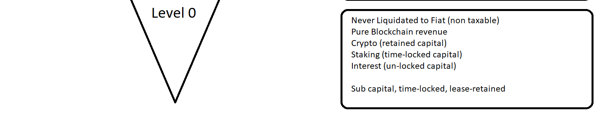
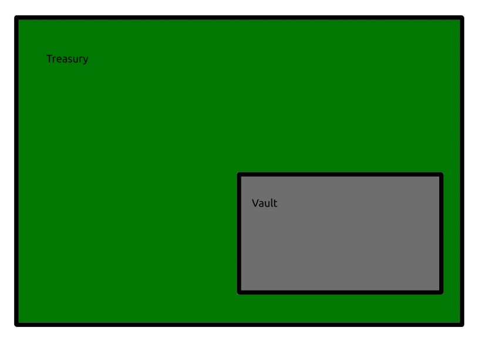

# DAO (Decentralized Autonomous Organization)

A **DAO** represents a set of rules encoded as a computer program (smart contracts) on a blockchain. These rules are transparent, controlled by shareholders, and devoid of centralized governance.

## Key Concepts:

- **Decentralized**: No central authority. Decisions are based on consensus or voting by the organization's stakeholders or token holders.
  
- **Autonomous**: DAOs operate based on pre-written smart contract conditions, allowing them to function without human intervention.

- **Organization**: A collective of individuals with a shared goal but with a distinct, non-traditional structure and decision-making process.

## Features:

### 1. Blockchain-Based 
DAOs utilize blockchain technology, ensuring transparency, immutability, and security.

### 2. Token Ownership
Members might own tokens that represent shares or voting rights in the DAO. These tokens can be bought, sold, or earned.

### 3. Smart Contracts 
Automated contracts on a blockchain that enforce and run the DAO's rules.

### 4. Consensus Decision Making 
Decision-making in DAOs typically relies on consensus among its members.

## Advantages:

- **Transparency**: All rules and transactions are auditable, thanks to the blockchain.
  
- **Security**: The decentralized and cryptographic nature of blockchains offers robust security.
  
- **Interoperability**: Potential for interaction with other blockchain systems and contracts.
  
- **Reduction of Intermediaries**: Automation via smart contracts reduces costs and potential points of failure.
  
- **Global Collaboration**: Allows participation from anywhere in the world.

## Challenges:

- **Code Vulnerabilities**: Flaws in the smart contract code can be exploited, leading to undesirable outcomes.
  
- **Complex Governance**: Decision-making can become cumbersome with a larger participant pool.
  
- **Regulatory Concerns**: Uncertain legal statuses in many areas can be challenging.
  
- **Human Factor**: Despite automation, human biases can still influence a DAO's operations.

---

**In Summary**: DAOs are a novel experiment in organization and governance made possible by blockchain technology. They offer both exciting possibilities and new challenges, and the journey of understanding and perfecting them is ongoing.

# What is The GreenWitchDAO?

The GreenWitchDAO is a self funding, self income generation system of finance embodied in the GreenWitchDAO system.  Built specifically to create optimum yield returns with automated A.I. guidance (specifically through SARA and BIANA), to assist the DAO to facilitate the transactions.  Flashloans, staking, liquidity pools, yield farming, and other chain revenue generation methods are analysed through FARA, the oracle to actually impliment all strategies.

This is the core of the DAO proper, of the GreenWitchDAO, is simply the core of Substrate with software pallets that create a distinction of systems embedded into the GreenWitchDAO proper, along with Ink! smart contracts to fill the gaps that the Substrate Pallets do not account for to create a nimble DAO.

The DAOs Parts (AccountTokens)
- Coin/Tokens, ***GDT***, 42,000,000 (million) of them (premined)
- Treasury, Holds activly generating, revenue for an assortment of coin/token assets
- - BTC
  - ETH
  - DOT
  - ATOM

 # Treasury and Vault
 
- Treasury, cultivates exchange pairs
- All exchange fees paid are fed into the Treasury
- - GDT-BTC
  - GDT-ETH
  - GDT-DOT
  - GDT-ATOM
 
- Vault, earmarks static value of assets,
- - mixes any asset braought in the Vault,
  - obtains stablecoins
  - sets in Vault (store of value)
 
